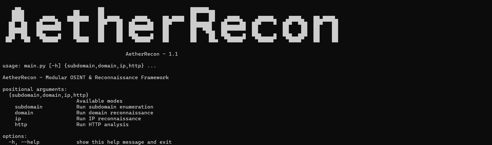
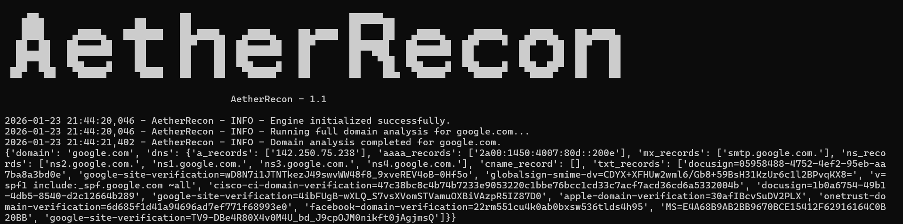
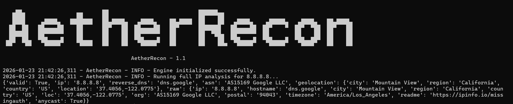

# 🜂 AetherRecon

> **AetherRecon** is a modular, extensible OSINT & reconnaissance framework designed for domain, IP, and subdomain intelligence gathering.

**Built with clean architecture, multi-module design, and scalability in mind.**

---

## ✨ Features

- 🔍 Domain reconnaissance (DNS, MX, NS, TXT, CNAME, A/AAAA)
- 🌐 Subdomain enumeration (bruteforce + crt.sh)
- 🧭 IP intelligence (ASN, geolocation, reverse DNS, WHOIS-style data)
- 🛰 HTTP analysis
- 🧩 Modular architecture
- 🛠 CLI-based interface

# 📸 Screenshoot's

- Main CLI

---
- Domain Analysis (CLI)

---
- IP Recon (CLI)

---
- Subdomain Recon (CLI)

## 📦 Installation

```bash
git clone https://github.com/cursedwind/AetherRecon.git
cd AetherRecon
pip install -r requirements.txt
```

# 🚀 Usage
- General help:
```bash
python main.py --help
```
---
- Domain analysis
```bash
python main.py domain example.com
```
- JSON Output
```bash
python main.py domain example.com --json
```
---
- IP analysis
```bash
python main.py ip 8.8.8.8
```
- JSON Output
```bash
python main.py ip 8.8.8.8 --json
```
---
- Subdomain Enumeration
```bash
python main.py subdomain example.com 
```
- JSON Output
```bash
python main.py subdomain example.com --json
```
---
- HTTP Analysis
```bash
python main.py http http://example.com
```
- JSON Output
```bash
python main.py http http://example.com --json
```
---

# 🧠 Architecture
```bash
AetherRecon/
├── core/
│   ├── app_logger.py
│   ├── config.py
│   └── engine.py
│
├── img/
│   ├── AetherRecon.png
│   ├── AetherRecon_Domain.png
│   ├── AetherRecon_IP.png
│   └── AetherRecon_Subdomain.png
│
├── modules/
│   └── domain/
│       ├── dns.py
│       ├── ip.py
│       └── subdomain.py
│
├── utils/
│   ├── http.py
│   └── parser.py
├── cli.py
├── main.py
├── README.md
└── requirements.txt
```

# ⚙️ Configuration
> Edit config.py to customize:
- Timeout values
- Enabled modules
- Debug mode
- API endpoints

# 🛡 Disclaimer
- **This tool is intended for educational and authorized security testing purposes only.**
> *The author is not responsible for any misuse.*

# ⭐ Author
> **Developed by *Cursed Wind*.**

# ❤️ Contributing
> **Pull requests, issues and feature ideas are welcome.**

---

